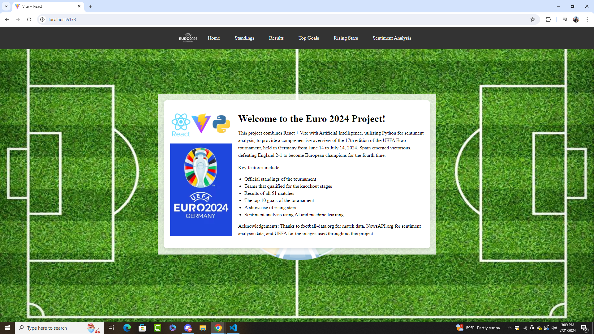

# Euro 2024 React + AI Project

Welcome to my Euro 2024 React + AI Project! This project combines React + Vite with Artificial Intelligence, utilizing Python for backend sentiment analysis, to provide a comprehensive overview of Euro 2024.



## Overview

This project aims to deliver detailed insights and features related to the Euro 2024 tournament. Key components include:

- Official standings of the tournament
- Teams that qualified for the knockout stages
- Results of all 51 matches
- The top 10 goals of the tournament
- A showcase of rising stars
- Sentiment analysis using AI and machine learning

APIs used:
- **Football-Data.org API:** For fetching match data and standings.
- **NewsAPI:** For fetching news articles and performing sentiment analysis.


## Features

- **Official Standings:** Displaying the standings of all teams in the tournament.
- **Knockout Stage Qualification:** Highlighting teams that made it to the knockout stages.
- **Match Results:** Detailed results of all 51 matches.
- **Top Goals:** A collection of the top 10 goals from the tournament.
- **Rising Stars:** Showcasing the rising stars of Euro 2024 with images and details.
- **Sentiment Analysis:** Analyzing sentiments from news articles using AI and machine learning.

## Functional Requirements

- **Frontend:** Built with React and Vite, providing a fast and interactive user interface.
- **Backend:** Developed with Python, handling data analysis and sentiment analysis using various AI techniques.

## Getting Started

### Prerequisites

- Node.js
- Python
- Git

### Running the Project

1. **Start the backend server:**

    ```bash
    cd euro-2024/backend
    python app.py
    ```

2. **Start the frontend server:**

    ```bash
    cd euro-2024
    npm run dev
    ```

## Acknowledgements

Thanks to football-data.org for match data, NewsAPI.org for sentiment analysis data, and UEFA for the images used throughout this project.
